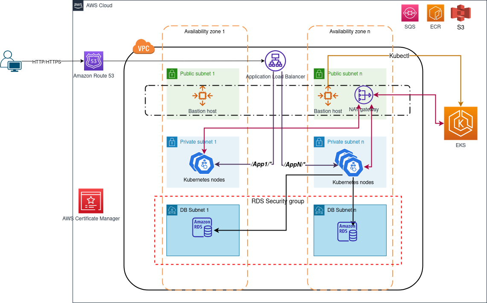

# Production grade EKS cluster
---


##  1. <a name='Summary'></a>Summary
---
<!-- vscode-markdown-toc -->
* 1. [Summary](#Summary)
* 2. [High level overview](#Highleveloverview)
* 3. [Prerequisites](#Prerequisites)
* 4. [Github Actions setup](#GithubActionssetup)
* 5. ["Main" Terraform module](#MainTerraformmodule)
	* 5.1. [Usage](#Usage)
	* 5.2. [Requirements](#Requirements)
	* 5.3. [Providers](#Providers)
	* 5.4. [Modules](#Modules)
	* 5.5. [Inputs](#Inputs)
	* 5.6. [Outputs](#Outputs)
	* 5.7. [Conditional creation](#Conditionalcreation)
	* 5.8. [Resources](#Resources)

<!-- vscode-markdown-toc-config
	numbering=true
	autoSave=true
	/vscode-markdown-toc-config -->
<!-- /vscode-markdown-toc -->

##  2. <a name='Highleveloverview'></a>High level overview
---


##  3. <a name='Prerequisites'></a>Prerequisites
---

To be able to run this Terraform module, the AWS credentials must be associated with a `user` having at least the following AWS managed IAM policies:

* `AmazonDynamoDBFullAccess`	
* `AmazonEC2ContainerRegistryFullAccess`	
* `AmazonEC2FullAccess`	
* `AmazonRDSFullAccess`	
* `AmazonRoute53FullAccess`	
* `AmazonS3FullAccess`	
* `AmazonSQSFullAccess`	
* `AmazonVPCFullAccess`	
* `IAMFullAccess`
* `AmazonElasticFileSystemFullAccess`

In addition, a new managed policy needs to be created:

*e.g: EKS-FULL-CLUSTER-ACCESS*

```json
{
    "Version": "2012-10-17",
    "Statement": [
        {
            "Effect": "Allow",
            "Action": [
                "eks:*"
            ],
            "Resource": "*"
        }
    ]
}
```

##  4. <a name='GithubActionssetup'></a>Github Actions setup
---
**Refer to the [tutorial document](.github/actions.md) for more details about how to set up github actions with AWS using OIDC**

##  5. <a name='MainTerraformmodule'></a>"Main" Terraform module
---
This module can be used to deploy an EKS cluster with various components and add-ons. Common deployment examples can be found in `examples/`. 

This module has the capability to `enable/disable` any submodule/components, This means that you can go from just deploying a bare EKS cluster with a certain node groups to deploy RDS databse, S3 buckets and add custom Kubernetes resources and even manage ALB and External DNS.

###  5.1. <a name='Usage'></a>Usage
---
Have a look at the [examples](examples/) for complete references

```terraform
module "example" {
  source = "./main"

  project-prefix = "deep-project"
  project-name   = "My project"
  account-id     = "123456789123"   
  Environment    = "Production"   
  EKS = {
    cluster-name = "my-cluster"
    k8s-version  = "1.22"
    network = {
      region          = "us-east-1"
      azs             = ["us-east-1a", "us-east-1b"]
      vpc             = "10.10.0.0/16"
      private-subnets = ["10.0.0.0/19", "10.0.32.0/19"]
      public-subnets  = ["10.0.128.0/20", "10.0.144.0/20"]
    }
    nodes = [
      {
        instance-type = "c6a.12xlarge"
        min           = 1
        max           = 1
        node-count    = 1
      },
      {
        instance-type = "t3.small"
        min           = 1
        max           = 3
        node-count    = 2
     }
    ]
  }
  aws-auth = {
    enabled = true
    users = [
      "my-user",
    ]
  }
  RDS = {
    enabled               = true
    db-name               = "my_name"
    engine                = "postgres"
    engine-version        = 14.1
    instance-class        = "db.t3.micro"
    username              = "my_user"
    password              = "my_password"
    allocated-storage     = 50
    max-allocated-storage = 100
    subnets               = ["10.0.192.0/21", "10.0.200.0/21"]
    enable-backup         = true
  }
  BASTION_HOST = {
    enabled             = true
    name                = "bastion"
    ingress-cidr-blocks = ["0.0.0.0/0"]
    ssh-key             = "ssh-rsa AAAAB3NzaC1yc2EAAAADAQABAAABgQDuMrTqpky5TIL8ltjL47T7SGxamJ8+5JmwUqYt+z5GbF3+WgcHWOCATlslF3FhvMOnUGFfxJrWI5FAo51r7T5m/mpGYPG431SREDkwgx3kLLvqD6sv1OOqmJbW1+5//dMoKab2kqKRyds1QETARjHqk1HTE1cv9gLqpqUqLlYKXDgPZHQtjNmlO2asBZgC5w4Q4tvWWHrNMkiT8LT64V0gA39BzXXnWFSsBuEMwr8oRGhBDxPYG760NAj6SyOIFUaW10ZCDJlWhR76u/K6ULPYn2jKpDeoawZkeLg6B3vjct9Fy13R9EOKdYtWUN9f8k8vz4vb4kkb3jiNcsPzNndEIg60BfNd4RZMq72pca3CNfXUIAZlHZqrrkLXDCTrfz7w+EkSjPfONmE2lY5n8wIufBTB0rUc5qEssvrWmOToXBNlsxAICvHBckPzR9AoBYn4bJr1ki8NrhsHl1xdo9+YZvAR94CQ3qN0sqkVmYABEk2fJFyS0fc7bSRr4CcQSeE= example@example.com"
    spec = {
      instance-type = "t2.small"
      image-ami     = "ami-0b5eea76982371e91"
      volume-size   = 10
      volume-type   = "gp2"
      min-size      = 1
      max-size      = 1
      desired-size  = 1
    }
  }
  ECR = {
    enabled = true
    repository-names = [
      "api",
      "scheduler",
      "web",
      "worker",
      "core"
    ]
  }
  S3 = {
    enabled = true
    bucket-names = [
      "data",
    ]
  }
  SQS = {
    enabled = true
    queue-names = [
      "example",
    ]
  }
  K8S = {
    enabled   = true
    namespace = "my_namespace"
    main-sa   = "my_sa"         
    db-secret = "my_db_secret"  
    runner = {
      enabled = true
      token   = "abcdefghejklmnopqrst123654789"
      tag     = "my_tag"
    }
    alb = {
      enabled   = true
      namespace = "kube-system"
      sa-name   = "alb-sa-iam"
    }
    dns = {
      enabled   = true
      namespace = "kube-system"
      sa-name   = "dns-sa-iam"
      domain    = "example.com"
    }
  }
 }
}
```
###  5.2. <a name='Requirements'></a>Requirements
---

|   Name	|   Version	| 	
|---	    |:-:	      |
|   Terraform	| >= 0.13.1 | 
|   	|   	|   	


###  5.3. <a name='Providers'></a>Providers
---

|  Name 	| Version  	| Required  	|
|---	|:-:	|---	|
|  aws 	|  > 4.18.0 	|  True<sup>1</sup> 	|
|  kubernetes 	|  2.5.0 	|  False<sup>2</sup> 	|
| helm  	| 2.3.0  	|  False<sup>2</sup> 	|
|  kubectl 	| >= 1.7.0  	|  False<sup>2</sup> 	|
|  tls 	|  4.0.1 	|  False<sup>2</sup> 	|
|||

<sup>1</sup> This provider is required to run the Terraform script to create the bare minimum of `required` resources.

<sup>2</sup> These providers used to create some `optional` resources and won't be used unless the required submodules are `enabled`.


###  5.4. <a name='Modules'></a>Modules
---
This Terraform module makes use of custom `submodules` as shown in this following table. In their turns each of these submodules can use their own modules from public registries. Please refer to the specification of each submodule to learn more about this.
 
|  Name 	| Source  	| Required  	|
|---	|:-:	|---	|
|  bastion 	|  [./main/modules/bastion](./main/modules/bastion) 	|  False 	|
|  cluster 	|  [./main/modules/cluster](./main/modules/cluster)  	|  True	|
|ecr  	| [./main/modules/ecr](./main/modules/ecr)   	|  False	|
|  kubernetes 	| [./main/modules/kubernetes](./main/modules/kubernetes)  	|  False 	|
|  OpenVPN 	|  [./main/modules/OpenVPN](./main/modules/OpenVPN)  	|  False 	|
|  s3 	|  [./main/modules/s3](./main/modules/s3)  	|  False 	|
|  sqs 	|  [./main/modules/sqs](./main/modules/sqs) 	|  False 	|
|||

###  5.5. <a name='Inputs'></a>Inputs
---
|  Name 	| Description  	| Type  	| Default | Required |
|---	    |:-:	          |---	    |---	    |---	     |
| project-prefix | Project prefix to be used in naming components   	          | `string`  	    | `null`       	| no         |
| project-name |  Project name to be used in tagging components   	          |   `string`	    |  `null`       	|   no       |
| account-id |   AWS account ID 	          |   `string`	    |   `null`      	|     no     |
| Environment |  e.g: Staging/Development/Production 	          |  `string` 	    |  `null`       	|  no        |
| EKS |   EKS cluster specifications`*`	          |   `any`	    |  `{}`       	|  yes        |
| RDS |  RDS database config`*` 	          |   `map(any)`	    | `{}`        	|      no    |
| BASTION_HOST |  Bastion host config`*` 	          |  `any` 	    |  `{}`       	|      no    |
| ECR | ECR repositories config`*`  	          | `map(any)`  	    | `{}`        	|     no     |
| S3 |  Buckets config`*`	          |  `map(any)` 	    |  `{}`       	|   no       |
| SQS |  SQS config`*` 	          |  `map(any)` 	    |  `{}`       	|  no        |
| K8S | Kubernetes resources config`*` 	          |  `any` 	    | `{}`       	|  no        |
| aws-auth |  Add users to be able to access the cluster`*`	          |  `map(any)` 	    | `{}`        	|   no       |
|   	          |   	    |        	|          |

`*` For more details on how to use and fill these objects, please refer to the documentation of each of their respective modules for full reference on the fields and their significations

###  5.6. <a name='Outputs'></a>Outputs
---

|  Name 	           | Description  	| 
|---	               |:-:	          |	    
| cluster-endpoint     |  EKS cluster endpoint 	          | 
| cluster-cert-auth |  Cluster CA certificate	          |   
| cluster-oidc-issuer |   	Cluster OIDC issuer          |  
| database-endpoint |  RDS database endpoint 	          |
| vpc-id |  VPC ID 	          |
| bastion-sec-group-id  	| Bastion security group id  	    |       
| bucket-arn 	| List of the ARNs of all created S3 bucket by this module 	    |   
| sqs-arn  	| List of the ARNs of all created SQS queues by this module   	    |   
| node-role-arn 	| Node groups ARN  	    |  
| node-role-arn | Nodegroups role arn |
|  	|  	    |   
###  5.7. <a name='Conditionalcreation'></a>Conditional creation
---
### Private access to EKS control plane
When `enabling` the creation of the bastion host. A security group will be created **automatically** to enable the bastion host to reach the cluster API server on port `443`. In case of a fully private EKS cluster, this Bastion host will be the only option to use to run `kubectl` commands to interact with the custer. 
```terraform
module "example" {

  # The rest of arguments are omitted for brevity

  BASTION_HOST = {
    enabled             = true
    # Omitted
  }  
}
```

### RDS
When `enabling` the creation of an RDS database. Two things will happen under the hood:

1. A security group will be created to restrict any request to the database except from the created EKS cluster default security group, this security group
   will only enable requests from inside the cluster on a ceratin port, *eg: 5432 for Postgres*
2. A Kubernetes `secret` will created in the project namespace that will hold all credentials to connect to the database
```terraform
module "example" {

  # The rest of arguments are omitted for brevity

  RDS = {
    enabled               = true
    # Omitted
  }
  
  K8S = {
    namespace = "my_namespace"
    db-secret = "my_db_secret"  
    # Omitted
  }
}
```

### Access other AWS services from Pods
When creating s3 buckets or SQS queues or both. A service account will be created automatically that has all the permission to interact with the created objects. This is done as mentioned in the [AWS DOCS](https://docs.aws.amazon.com/eks/latest/userguide/enable-iam-roles-for-service-accounts.html). In the example below, we can assume that a service account `my_sa` will be created in namespace `my_namespace` that uses an on the fly created `IAM OIDC provider` to use IAM roles`*` for service accounts. Later if you attach `my_sa` service account to any pod, that pod will have all the permissions to access the created objects.

```terraform
module "example" {

  # The rest of arguments are omitted for brevity
  S3 = {
    enabled = true
    bucket-names = [
      "data",
    ]
  }
  SQS = {
    enabled = true
    queue-names = [
      "example",
    ]
  }
  K8S = {
    namespace = "my_namespace"
    main-sa   = "my_sa"         
  }
}
```

`*` 
###  5.8. <a name='Resources'></a>Resources
---

|   Name	|   Type    	| 	
|---	    |:-:	      |
|   [aws_security_group.bastion](https://registry.terraform.io/providers/hashicorp/aws/latest/docs/data-sources/security_group)	| data source | 
|   [aws_subnets.public](https://registry.terraform.io/providers/hashicorp/aws/latest/docs/data-sources/subnet)	| data source |
|   [aws_vpc.eks](https://registry.terraform.io/providers/hashicorp/aws/latest/docs/data-sources/vpc)	| data source |
|   [aws_key_pair.key-pair](https://registry.terraform.io/providers/hashicorp/aws/latest/docs/resources/key_pair)	| resource |
|   [aws_eks_cluster_auth.eks-cluster](aws_eks_cluster_auth)	| data source |
|   [aws_iam_policy_document.alb-document](https://registry.terraform.io/providers/hashicorp/aws/latest/docs/data-sources/iam_policy_document)	| data source |
|   [aws_iam_policy_document.external-dns-document](https://registry.terraform.io/providers/hashicorp/aws/latest/docs/data-sources/iam_policy_document)	| data source |
|   [aws_iam_policy_document.s3-and-sqs-policy-document](https://registry.terraform.io/providers/hashicorp/aws/latest/docs/data-sources/iam_policy_document)	| data source |
|   [aws_route53_zone.hosted-zone](https://registry.terraform.io/providers/hashicorp/aws/latest/docs/data-sources/route53_zone)	| data source |
|   [tls_certificate.tls-cert](https://registry.terraform.io/providers/hashicorp/tls/latest/docs/data-sources/certificate)	| data source |
|   [aws_iam_openid_connect_provider.oidc](https://registry.terraform.io/providers/hashicorp/aws/latest/docs/resources/iam_openid_connect_provider)	| resource |
|   [aws_iam_policy.alb-policy](https://registry.terraform.io/providers/hashicorp/aws/latest/docs/resources/iam_policy)	| resource |
|   [aws_iam_policy.external-dns-policy](https://registry.terraform.io/providers/hashicorp/aws/latest/docs/resources/iam_policy)	| resource |
|   [aws_iam_policy.s3-and-sqs-policy](https://registry.terraform.io/providers/hashicorp/aws/latest/docs/resources/iam_policy)	| resource |
|   [aws_iam_role.alb-role](https://registry.terraform.io/providers/hashicorp/aws/latest/docs/resources/iam_role)	| resource |
|   [aws_iam_role.external-dns-role](https://registry.terraform.io/providers/hashicorp/aws/latest/docs/resources/iam_role)	| resource |
|   [aws_iam_role.s3-and-sqs-role](https://registry.terraform.io/providers/hashicorp/aws/latest/docs/resources/iam_role)	| resource |
|   [aws_iam_role_policy_attachment.alb-role-policy-attachement](https://registry.terraform.io/providers/hashicorp/aws/latest/docs/resources/iam_role_policy_attachment)	| resource |
|   [aws_iam_role_policy_attachment.external-dns-role-policy-attachement](https://registry.terraform.io/providers/hashicorp/aws/latest/docs/resources/iam_role_policy_attachment)	| resource |
|   [aws_iam_role_policy_attachment.s3-and-sqs-role-policy-attachement](https://registry.terraform.io/providers/hashicorp/aws/latest/docs/resources/iam_role_policy_attachment)	| resource |
|   [helm_release.alb-ingress-controller](https://registry.terraform.io/providers/hashicorp/helm/latest/docs/resources/release)	| resource |
|   [helm_release.external-dns-controller](https://registry.terraform.io/providers/hashicorp/helm/latest/docs/resources/release)	| resource |
|   [helm_release.gitlab-runner](https://registry.terraform.io/providers/hashicorp/helm/latest/docs/resources/release)	| resource |
|   [kubernetes_cluster_role.gitlab-runner](https://registry.terraform.io/providers/hashicorp/kubernetes/latest/docs/resources/cluster_role)	| resource |
|   [kubernetes_cluster_role_binding.gitlab-runner](https://registry.terraform.io/providers/hashicorp/kubernetes/latest/docs/resources/cluster_role_binding)	| resource |
|   [kubernetes_namespace.ns](https://registry.terraform.io/providers/hashicorp/kubernetes/latest/docs/resources/namespace)	| resource |
|   [kubernetes_secret.database-credentials](https://registry.terraform.io/providers/hashicorp/kubernetes/latest/docs/resources/secret)	| resource |
|   [kubernetes_service.database-service](https://registry.terraform.io/providers/hashicorp/kubernetes/latest/docs/resources/service)	| resource |
|   [kubernetes_service_account.alb-service-account](https://registry.terraform.io/providers/hashicorp/kubernetes/latest/docs/resources/service_account)	| resource |
|   [kubernetes_service_account.dns-service-account](https://registry.terraform.io/providers/hashicorp/kubernetes/latest/docs/resources/service_account)	| resource |
|   [kubernetes_service_account.service-account](https://registry.terraform.io/providers/hashicorp/kubernetes/latest/docs/resources/service_account)	| resource |
|   [aws_ecr_repository.repository](https://registry.terraform.io/providers/hashicorp/aws/latest/docs/resources/ecr_repository)	| resource |
|   [aws_db_instance.postgres](https://registry.terraform.io/providers/hashicorp/aws/latest/docs/resources/db_instance)	| resource |
|   [aws_eks_cluster.eks-cluster](https://registry.terraform.io/providers/hashicorp/aws/latest/docs/resources/eks_cluster)	| resource |
|   [aws_eks_node_group.eks-node-group](https://registry.terraform.io/providers/hashicorp/aws/latest/docs/resources/eks_node_group)	| resource |
|   [aws_iam_instance_profile.node-profile](https://registry.terraform.io/providers/hashicorp/aws/latest/docs/resources/iam_instance_profile)	| resource |
|   [aws_iam_role.cluster-role](https://registry.terraform.io/providers/hashicorp/aws/latest/docs/resources/iam_role)	| resource |
|   [aws_iam_role.node-role](https://registry.terraform.io/providers/hashicorp/aws/latest/docs/resources/iam_role)	| resource | 
|   [aws_iam_role_policy_attachment.Amazon-EKS-VPC-ResourceController](https://registry.terraform.io/providers/hashicorp/aws/latest/docs/resources/iam_role_policy_attachment)	| resource |
|   [aws_iam_role_policy_attachment.amazon-EC2-container-registry-ReadOnly](https://registry.terraform.io/providers/hashicorp/aws/latest/docs/resources/iam_role_policy_attachment)	| resource |
|   [aws_iam_role_policy_attachment.amazon-EKS-CNI-policy](https://registry.terraform.io/providers/hashicorp/aws/latest/docs/resources/iam_role_policy_attachment)	| resource |
|   [aws_iam_role_policy_attachment.amazon-EKS-cluster-policy](https://registry.terraform.io/providers/hashicorp/aws/latest/docs/resources/iam_role_policy_attachment)	| resource |
|   [aws_iam_role_policy_attachment.amazon-EKS-service-policy](https://registry.terraform.io/providers/hashicorp/aws/latest/docs/resources/iam_role_policy_attachment)	| resource |
|   [aws_iam_role_policy_attachment.amazon-EKS-worker-node-polic](https://registry.terraform.io/providers/hashicorp/aws/latest/docs/resources/iam_role_policy_attachment)	| resource |
|   [aws_s3_bucket.s3-bucket](https://registry.terraform.io/providers/hashicorp/aws/latest/docs/resources/s3_bucket)	| resource |
|   [aws_s3_bucket_acl.s3-bucket-acl](https://registry.terraform.io/providers/hashicorp/aws/latest/docs/resources/s3_bucket_acl)	| resource |
|   [aws_s3_bucket_metric.s3-bucket-metric](https://registry.terraform.io/providers/hashicorp/aws/latest/docs/resources/s3_bucket_metric)	| resource |
|   [aws_s3_bucket_public_access_block.s3-bucket-public-block](https://registry.terraform.io/providers/hashicorp/aws/latest/docs/resources/s3_bucket_public_access_block)	| resource |
|   [aws_s3_bucket_server_side_encryption_configuration.s3-encrypt-config](https://registry.terraform.io/providers/hashicorp/aws/latest/docs/resources/s3_bucket_server_side_encryption_configuration)	| resource |
|   [aws_sqs_queue.sqs-queue](https://registry.terraform.io/providers/hashicorp/aws/latest/docs/resources/sqs_queue)	| resource |
|   [aws_autoscaling_group.this](https://registry.terraform.io/providers/hashicorp/aws/latest/docs/resources/autoscaling_group)	| resource |
|   [aws_launch_configuration.this](https://registry.terraform.io/providers/hashicorp/aws/latest/docs/resources/launch_configuration)	| resource |
|   [random_pet.asg_name](https://registry.terraform.io/providers/hashicorp/random/latest/docs/resources/pet)	| resource |
|   [aws_security_group.this_name_prefix](https://registry.terraform.io/providers/hashicorp/aws/latest/docs/resources/security_group)	| resource |
|   [aws_security_group_rule.egress_rules](https://registry.terraform.io/providers/hashicorp/aws/latest/docs/resources/security_group_rule)	| resource |
|   [aws_security_group_rule.ingress_rules](https://registry.terraform.io/providers/hashicorp/aws/latest/docs/resources/security_group_rule)	| resource |
|   [aws_db_subnet_group.database](https://registry.terraform.io/providers/hashicorp/aws/latest/docs/resources/db_subnet_group)	| resource |
|   [aws_eip.nat](https://registry.terraform.io/providers/hashicorp/aws/latest/docs/resources/eip)	| resource |
|   [aws_internet_gateway.this](https://registry.terraform.io/providers/hashicorp/aws/latest/docs/resources/internet_gateway)	| resource |
|   [aws_nat_gateway.this](https://registry.terraform.io/providers/hashicorp/aws/latest/docs/resources/nat_gateway)	| resource |
|   [aws_route.private_nat_gateway](https://registry.terraform.io/providers/hashicorp/aws/latest/docs/resources/route)	| resource |
|   [aws_route.public_internet_gateway](https://registry.terraform.io/providers/hashicorp/aws/latest/docs/resources/route)	| resource |
|   [aws_route_table.private](https://registry.terraform.io/providers/hashicorp/aws/latest/docs/resources/route_table)	| resource |
|   [aws_route_table.public](https://registry.terraform.io/providers/hashicorp/aws/latest/docs/resources/route_table)	| resource |
|   [aws_route_table_association.database](https://registry.terraform.io/providers/hashicorp/aws/latest/docs/resources/route_table_association)	| resource |
|   [aws_route_table_association.private](https://registry.terraform.io/providers/hashicorp/aws/latest/docs/resources/route_table_association)	| resource |
|   [aws_route_table_association.public](https://registry.terraform.io/providers/hashicorp/aws/latest/docs/resources/route_table_association)	| resource |
|   [aws_subnet.database](https://registry.terraform.io/providers/hashicorp/aws/latest/docs/resources/subnet)	| resource |
|   [aws_subnet.private](https://registry.terraform.io/providers/hashicorp/aws/latest/docs/resources/subnet)	| resource |
|   [aws_subnet.public](https://registry.terraform.io/providers/hashicorp/aws/latest/docs/resources/subnet)	| resource |
|   [aws_vpc.this](https://registry.terraform.io/providers/hashicorp/aws/latest/docs/resources/vpc)	| resource |
|   [aws_db_instance.postgres](https://registry.terraform.io/providers/hashicorp/aws/latest/docs/data-sources/db_instance)	| data source |
|   [aws_security_group.cluster](https://registry.terraform.io/providers/hashicorp/aws/latest/docs/data-sources/security_group)	| data source |
|   [aws_security_group.cluster-ssh-vpc](https://registry.terraform.io/providers/hashicorp/aws/latest/docs/data-sources/security_group)	| data source |
|   [aws_security_group.node](https://registry.terraform.io/providers/hashicorp/aws/latest/docs/data-sources/security_group)	| data source |
|   [aws_security_group.rds](https://registry.terraform.io/providers/hashicorp/aws/latest/docs/data-sources/security_group)	| data source |
|   [aws_subnets.private](https://registry.terraform.io/providers/hashicorp/aws/latest/docs/data-sources/subnet)	| data source |
|   [aws_subnets.public](https://registry.terraform.io/providers/hashicorp/aws/latest/docs/data-sources/subnet)	| data source |
|   	|   	|   	


